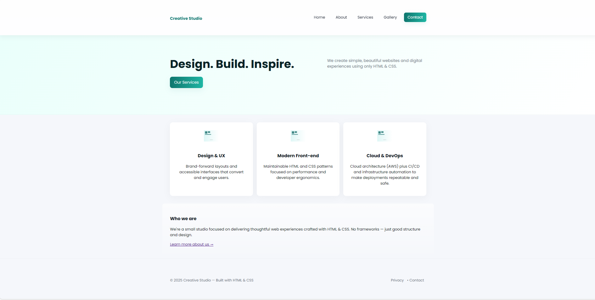
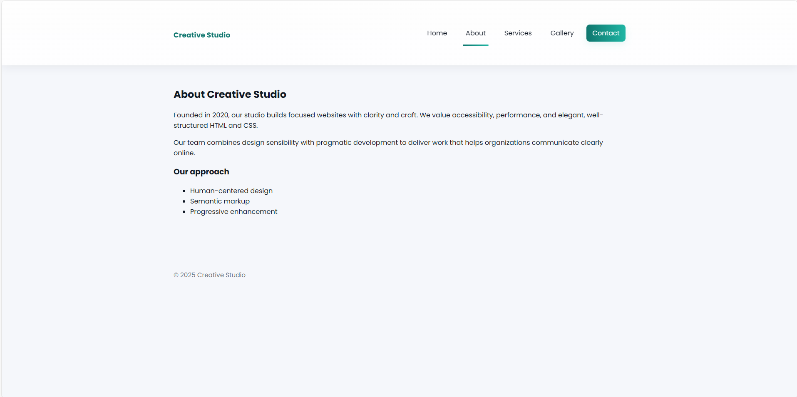
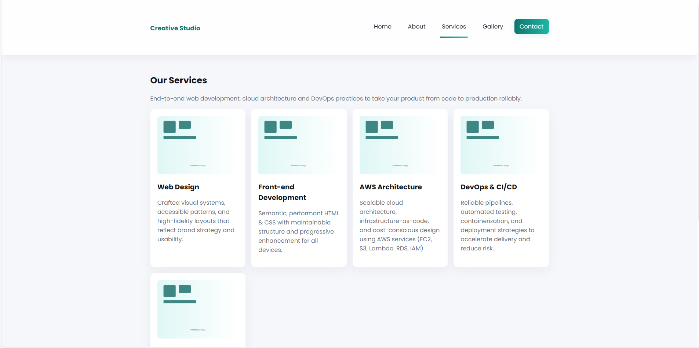
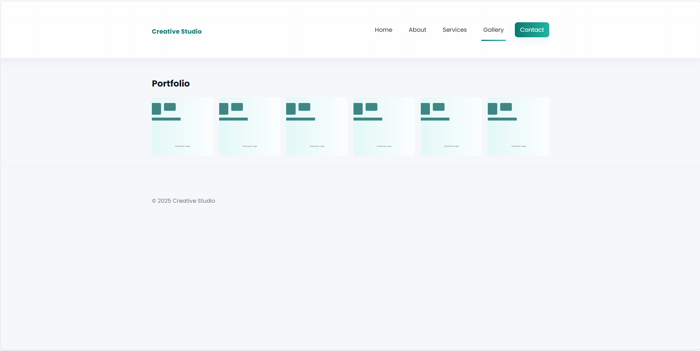
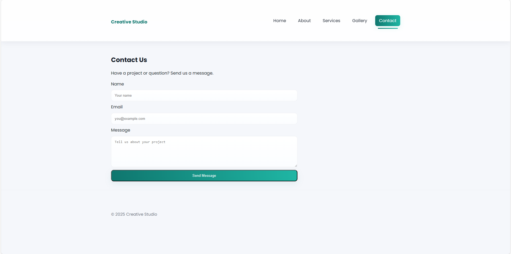

Creative Studio – Multi-Page HTML & CSS Website
A clean and professional multi-page business website built using HTML and CSS.
This project includes responsive layouts, service listing pages, a gallery, and a simple contact form.

📌 Project Description

This website is designed as a modern business/agency site with multiple pages:

index.html – Home

about.html – About the company

services.html – Services + added DevOps & AWS services

gallery.html – Portfolio/Gallery

contact.html – Contact form (mailto-based)

The project uses a consistent layout, clean typography, and structured sections for a professional look.

🛠️ Tech Used
Technology	Purpose
HTML5	Page structure
CSS3	Styling & layout
Flexbox	Alignment & responsiveness
Google Fonts (Poppins)	Typography
SVG / PNG Assets	Images
Git & GitHub	Version control & hosting
📁 Project Structure
DEVOPS PROJECT/
│
├── css/
│   └── styles.css
│
├── images/
│   └── placeholder.svg
│
├── about.html
├── contact.html
├── gallery.html
├── index.html
├── services.html
└── README.md

📸 Screenshots

You can add your screenshots here after capturing them.

Example:

Home Page

About Page

Services Page

Gallery Page

Contact Page

▶️ How to Preview the Project Locally
Windows (PowerShell)

Run:

ii .\index.html

Or simply double-click index.html.

VS Code Live Server

If using the Live Server extension:

Right-click index.html

Click "Open with Live Server"

✅ README Completed.
